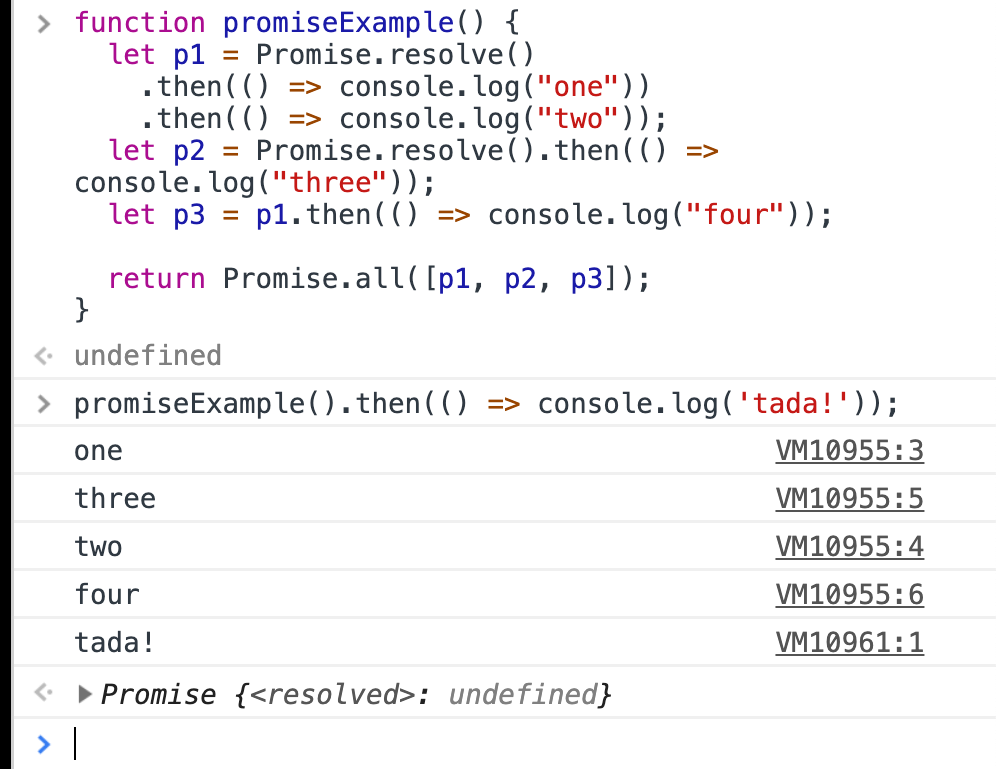

import { Appear, Image } from "mdx-deck";
import { Split, SplitRight } from "mdx-deck/layouts";
import { CodeSurfer } from "mdx-deck-code-surfer";
import { range } from "./helpers";

export { dark as theme } from "mdx-deck/themes";

# Async Testing

_"sprinkle some time on it"_

---

# Async can be difficult

- Time
- Learning curve
- Not intuitive
- Leads to non-deterministic (flaky) tests

---

# Flaky tests are not useful

> "Non-deterministic tests have two problems, firstly they are useless, secondly they are a virulent infection that can completely ruin your entire test suite."

- Martin Fowler

---

# Common mistakes

- Not returning promises, from tests or actions etc.
- Conditional expectations
- Missing `expect.assertions`
- Random timeouts
- Code generated tests

---

# Avoiding mistakes

- Use `npm run test-strict` during development
- It'll catch tests without assertions and broken promises
- ESLint

---

# Dealing with time

- What is async? Understand the rules
- Control
- Simplify
- Observe

---

<CodeSurfer
  title="Knowledge is power"
  code={require("!raw-loader!./snippets/promises.js").default}
  lang="javascript"
  dark={false}
  steps={[
    { notes: "Promises follow a pre-defined rule set, the Promises/A+ spec" },
    {
      notes:
        "Promise callbacks are SCHEDULED when a promise settles (resolve/reject)."
    },
    {
      notes: `Then callbacks must execute in the order of they were SCHEDULED.`
    },
    {
      notes: "Let's see what ths looks like in our example"
    },
    {
      tokens: { 12: [0, 1, 2, 3] },
      notes: "Invoke our function generating promises"
    },
    {
      tokens: { 3: [4, 5, 6, 7, 8] },
      notes: "First promise is created and immediately resolved"
    },
    {
      lines: [4],
      notes: "First then callback is SCHEDULED, creating a new pending promise"
    },
    {
      lines: [5],
      tokens: { 3: [1, 2, 3] },
      notes: "Another then callback is QUEUED, but not yet scheduled"
    },
    {
      tokens: { 6: range(5, 4) },
      notes: "A second promise is created and immediately resolved"
    },
    {
      tokens: { 6: [1, 2, 3, ...range(13, 9)] },
      notes: "Second then callback is SCHEDULED, creating a new pending promise"
    },
    {
      lines: [7],
      notes:
        "Another then callback is queued, because the promise it depends on is yet to settle"
    },
    {
      lines: [9],
      notes: "The final promise depending on all our work is returned"
    },
    {
      tokens: { 12: range(14, 4) },
      notes: "The final then callback is QUEUED"
    },
    {
      tokens: { 4: range(10, 4) },
      notes: "The first callback executes, settling the promise"
    },
    {
      lines: [5],
      notes: "Next callback is QUEUED"
    },
    {
      tokens: { 6: range(12, 12) },
      notes: "Second callback is executed"
    },
    {
      tokens: { 5: range(10, 4) },
      notes: "Third callback executes, settling 'p1'"
    },
    {
      tokens: { 7: range(14, 5) },
      notes: "Callback attached to p1 can now be SCHEDULED"
    },
    {
      tokens: { 7: range(10, 8) },
      notes: "Callback executes as it's the only one scheduled"
    },
    {
      tokens: { 9: range(11, 3) },
      notes: "All work is complete, .all is settled"
    },
    {
      tokens: { 12: range(10, 7) },
      notes: "Final callback is SCHEDULED and executed"
    }
  ]}
/>

---

---

# Use the spec to your advantage

- When mocking network is prefered
- Isolated (unit) tests
- TDD
- The fetch logic is simple and not likely to change
- Pretty much always improtant

---

<CodeSurfer
  title="Practical application of the spec"
  code={require("!raw-loader!./snippets/use-the-spec.js").default}
  lang="javascript"
  dark={false}
  steps={[
    {
      notes:
        "Here is how this knowledge of the Promise spec can be applied in a test"
    },
    {
      range: [3, 31],
      notes:
        "Here's our component, it renders samples and allows the user to see more"
    },
    {
      range: [3, 31],
      notes: "Let's exercise our new knowledge to test this logic onClick logic"
    },
    {
      lines: [35],
      notes: "Initial mount in a test, leads to..."
    },
    {
      range: [17, 28],
      notes: "A render without sample data"
    },
    {
      lines: [36],
      tokens: {
        26: [5, 6, 7]
      },
      notes: "We simulate the click event"
    },
    {
      tokens: { 9: range(4, 1) },
      notes: "Which proceeds to create a promise(resolved)"
    },
    {
      tokens: {
        9: range(7, 5)
      },
      notes: "Which allows us to SCHEDULE a promise callback via .then"
    },
    {
      tokens: {
        38: range(8, 1)
      },
      notes: "We can then manually SCHEDULE another promise callback"
    },
    {
      range: [10, 12],
      notes: "According to the spec, the first scheduled callback runs first"
    },
    {
      lines: [39],
      notes: "According to the spec, the last shceduled callback runs last"
    },
    {
      lines: [39],
      notes: "The test passes"
    }
  ]}
/>

---

# Taking control of the time itself

- TDD
- When promise chains are complex (multiple chained .thens)
- componentDidMount() & enzyme issues

---

<CodeSurfer
  title="Controling time"
  code={require("!raw-loader!./snippets/callback-refactor.js").default}
  lang="javascript"
  dark={false}
  steps={[
    {
      notes:
        "Promises are advanced, but built on top of basic primitives like callback functions"
    },
    {
      notes: "We can take advantage of this fact to make our code more testable"
    },
    { notes: "Step 1: Identify the callback function" },
    {
      tokens: { 8: [6, 7, 8, 9] },
      lines: [9, 10],
      notes: "Here it is, how is it invoked?"
    },
    {
      tokens: { 8: [1, 2, 3, 4, 5] },
      range: [6, 7],
      notes: "Through this promise chain"
    },
    {
      tokens: { 8: [1, 2, 3, 4, 5] },
      range: [6, 7],
      notes: "What if we removed time from the equation entirely?"
    },
    {
      tokens: { 8: [1, 2, 3, 4, 5] },
      range: [6, 7],
      notes: "We need a way to override this logic"
    }
  ]}
/>

---

<CodeSurfer
  title="Functions all the way down"
  code={require("!raw-loader!./snippets/callback-refactor-2.js").default}
  lang="javascript"
  dark={false}
  steps={[
    { range: [4, 8], notes: "Step 1: Make it a prop" },
    {
      range: [4, 8],
      notes: "Step 2: Wrap the service so that it uses callbacks"
    },
    { range: [12, 19], notes: "Step 3: Use the primitive callback pattern" },
    { range: [12, 19], notes: "Now let's see why it's easier to test" },
    { lines: [28], notes: "Simple functioins are simpler to mock" },
    {
      tokens: { 29: [7, 8, 9, 10, 11, 12, 13, 14, 15] },
      notes: "We can overwrite props"
    },
    { lines: [30], notes: "Now when we click..." },
    { lines: [11, 12], notes: "Click handler runs and invokes our mock prop" },
    {
      tokens: { 28: [...Array(17).keys()].map(k => k + 8) },
      notes: "We removed time from the equation! (without breaking the API)"
    },
    {
      range: [16, 18],
      notes: "The callback is invoked immediately"
    },
    { lines: [31], notes: "And the test passes" }
  ]}
/>

---

# Simplifying redux test

- The component can be accessed directly
- When you have access to the redux store/actions/reducers
- TDD

---

<CodeSurfer
  title="Simplify"
  code={require("!raw-loader!./snippets/simplify-example.js").default}
  lang="javascript"
  dark={false}
  steps={[
    { notes: "Here is a classic redux example with async actions" },
    { range: [1, 14], notes: "Our component is now purely functional" },
    { range: [16, 19], notes: "With a traditional connect setup" },
    { range: [23, 27], notes: "Which uses a thunk for getSamples call now" },
    { notes: "Let's see how we can simplify this to and test the logic" }
  ]}
/>

---

<CodeSurfer
  title="Split up logic to make it simpler to test"
  code={require("!raw-loader!./snippets/simplify-example-2.js").default}
  lang="javascript"
  dark={false}
  steps={[
    { notes: "Redux allows us to split our async logic into discrete steps" },
    {
      notes:
        "We can, for example run our actions BEFORE rendering the component"
    },
    { lines: [32], notes: "We begin by creating the stand-alone redux store" },
    { lines: [33], notes: "Then we dispatch the action by itself" },
    {
      lines: [24],
      notes: "Notice that we are returning the promise inside the action"
    },
    { lines: [25], notes: "The action completes and dispatches an action" },
    {
      lines: [35],
      notes: "Which should update the store, which we will assert."
    },
    {
      range: [37, 41],
      notes: "Now we can render the component with an already updated store."
    },
    {
      range: [37, 41],
      notes:
        "Note that the store is already updated, all we need is the render output"
    },
    {
      lines: [43],
      notes: "Finally, we assert that the component rendered correctly"
    }
  ]}
/>

---

# Redux ledger

- All async logic is powered via redux
- Actions cause other async actions and so on (cascade)
- Difficult to reason about flow
- More info at githug.com/wayfair/redux-ledger

---

<CodeSurfer
  title="Redux actions ledger"
  code={require("!raw-loader!./snippets/redux-ledger.js").default}
  lang="javascript"
  dark={false}
  steps={[
    {
      notes:
        "When the behavior of the redux app is complex you might want to try an alternative approach"
    },
    {
      notes:
        "This is when you may OBSERVE the behavior of the redux app from the outside, with redux-ledger"
    },
    {
      lines: [32],
      notes: "Ledger is a midddleware which keeps track of all async actions"
    },
    {
      lines: [32, 33],
      notes:
        "You create the middleware in a test and inject it into the store, like so"
    },
    {
      range: [35, 39],
      notes: "You then use the store as you would before when mounting your app"
    },
    {
      lines: [41],
      notes:
        "We can then proceed to simulate the click handler and let the actions play out"
    },
    {
      lines: [23, 24, 43],
      notes:
        "Ledger middleware will allow you to wait for all the actions to complete"
    },
    {
      lines: [25],
      notes: "Ledger will not resolve until ALL actions are dispatched"
    },
    {
      lines: [23, 24, 43],
      notes:
        "Note that we are returning the promise in our action as before, this is important"
    },
    {
      lines: [44, 45],
      notes:
        "When the actions are complete, we can then proceed to run our assertions"
    }
  ]}
/>

---

# When all else fails...

- You got a mess of code to deal with
- The logic is impossible to shim (Apollo)
- The logic is brittle and you need coverage to refactor
- Maybe you simply want to sanity check your initial approach?

---

<CodeSurfer
  title="Wait for expectations"
  code={require("!raw-loader!./snippets/apollo-example.js").default}
  lang="javascript"
  dark={false}
/>

---

# FIN

- Source: https://github.com/ballercat/practical-async-test-talk
